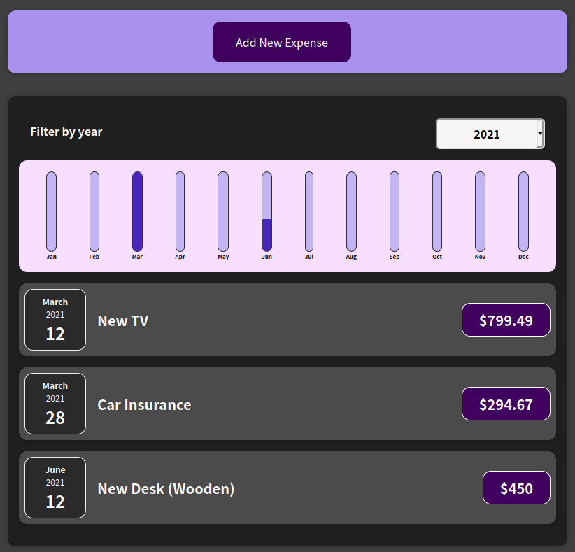

# Expense Tracker

## 💻 Projeto

Projeto desenvolvido com base nas aulas do curso [React - The Complete Guide (incl Hooks, React Router, Redux)][course], oferecido por [Maximilian Schwarzmüller][author].

## 🛠 Tecnologias

As seguintes tecnologias foram utilizadas no desenvolvimento do projeto:

- [TypeScript][typescript]
- [React][react]

## 📷 Screenshots

<kbd>
  
</kbd>

[course]: https://www.udemy.com/course/react-the-complete-guide-incl-redux/
[author]: https://www.udemy.com/user/maximilian-schwarzmuller/
[typescript]: https://www.typescriptlang.org/
[react]: https://reactjs.org/
